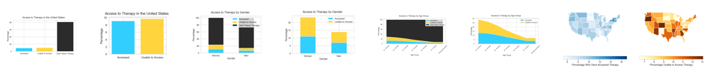
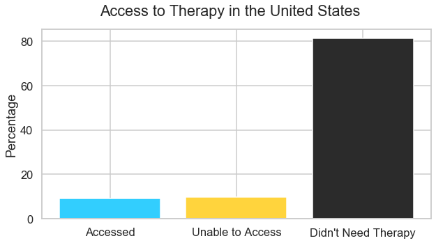
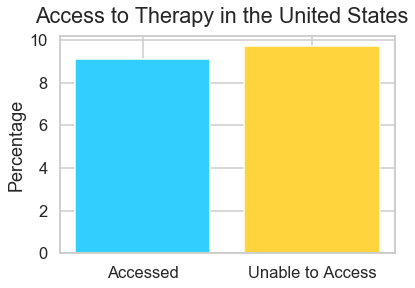
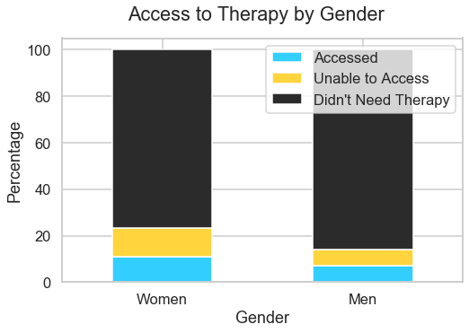
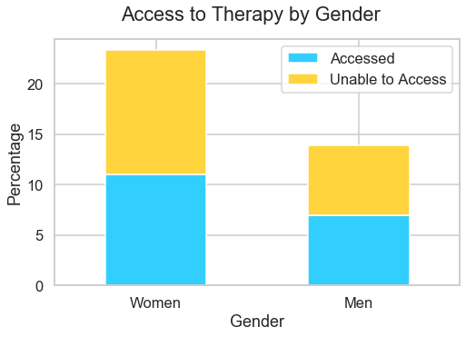
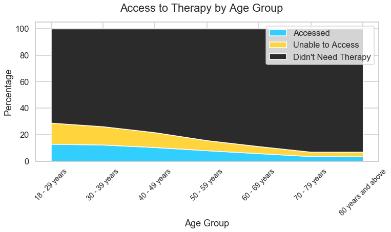
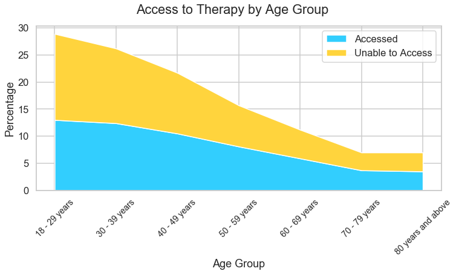
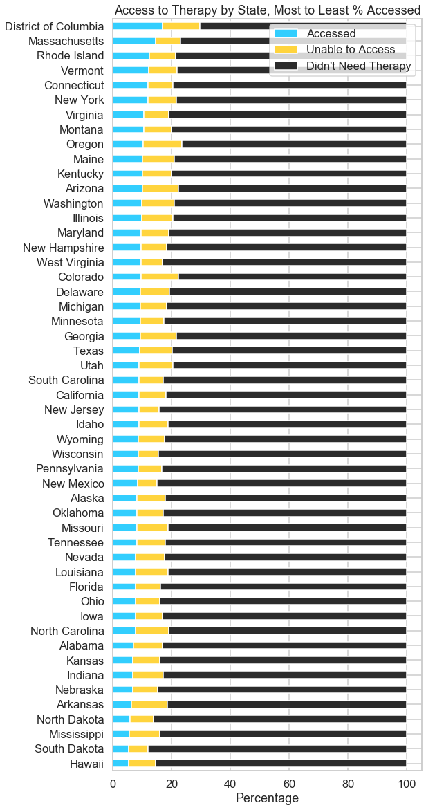
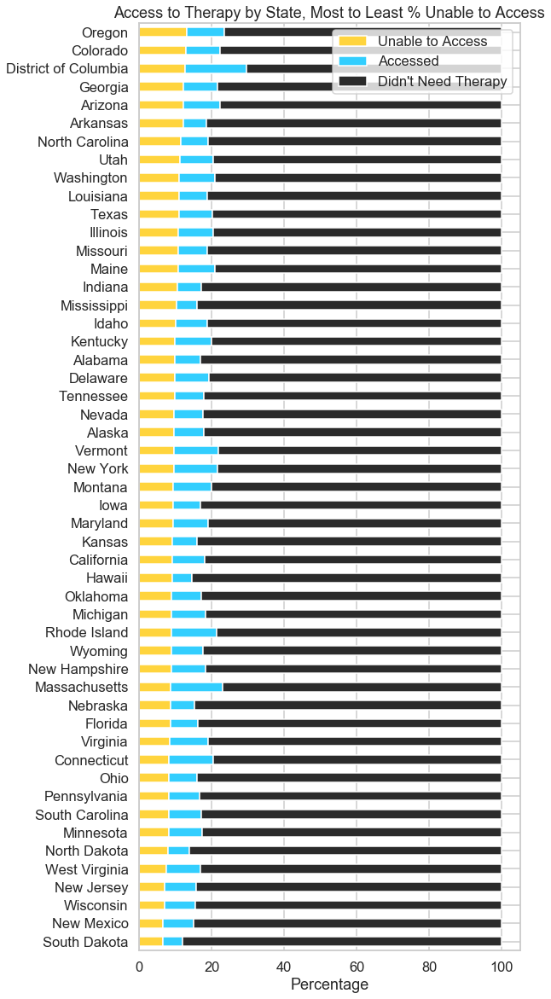
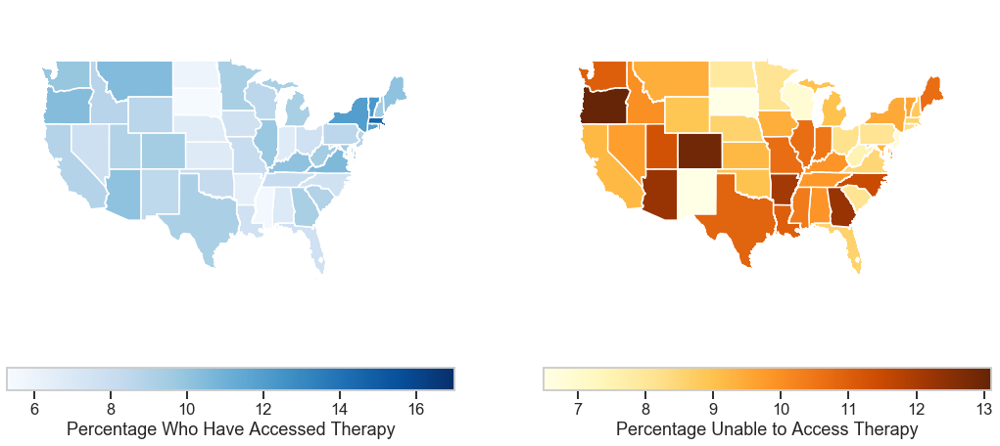

# Visualize It!
## Mental Health Data in the Time of COVID-19



Erin Hoffman — Data Science Coach at [Flatiron School](https://flatironschool.com/)

September 29th, 2020

(You can find me on [LinkedIn](https://www.linkedin.com/in/erinrachaelhoffman/), [GitHub](https://github.com/hoffm386), and [Medium](https://medium.com/@erin_r_hoffman))

This notebook walks through a [dataset from the CDC](https://www.cdc.gov/nchs/covid19/pulse/mental-health-care.htm) that was collected as part of an experimental new 2020 survey called the Household Pulse Survey.  It has fewer than 100 downloads so far according to the CDC website!

Data from this dataset represents the past month in the United States, which means August 19th - 31st and September 2nd - 14th for this workshop

We are going to use Python libraries to create visualizations to understand this data

## About the Data

### Survey Questions

##### _At any time in the last 4 weeks, did you take prescription medication to help you with any emotions or with your concentration, behavior or mental health?_

##### _At any time in the last 4 weeks, did you receive counseling or therapy from a mental health professional such as a psychiatrist, psychologist, psychiatric nurse, or clinical social worker? Include counseling or therapy online or by phone._

##### _At any time in the last 4 weeks, did you need counseling or therapy from a mental health professional, but did not get it for any reason?_

### Data Source

#### Sample size: 92,956 respondents
(for September 2nd - 14th data)

### Collecting the Data from the CDC Website


```python
# Un-comment these lines of code if you get an error message importing geopandas
# ! pip install geopandas
# ! pip install descartes
```


```python
# Library imports
import requests
import pandas as pd
import matplotlib.pyplot as plt
import seaborn as sns
import geopandas
```


```python
# Colors and styling

# DataFrame fonts
# Credit: https://stackoverflow.com/a/58801427/11482491
heading_properties = [('font-size', '16px')]
cell_properties = [('font-size', '16px')]
df_style = [dict(selector="th", props=heading_properties),\
 dict(selector="td", props=cell_properties)]

# DataFrame percentage formatting
# Credit: https://stackoverflow.com/a/55624414/11482491
df_format = {
    "Accessed": "{:.1f}%",
    "Unable to Access": "{:.1f}%",
    "Didn't Need Therapy": "{:.1f}%"
}

# Graph styles
sns.set_style("whitegrid")
# plt.style.use('dark_background')
sns.set_context("talk")

# Graph colors
flatiron_blue = "#32cefe"
workzone_yellow = "#ffd43d"
slate_gray = "#2b2b2b"
```


```python
url = "https://data.cdc.gov/resource/yni7-er2q.json"
response = requests.get(url)
```

We are hoping for a 200 status code, meaning the request was successful


```python
response
```


    <Response [200]>


```python
data_json = response.json()
```


```python
df = pd.DataFrame(data_json)
```


```python
df.head()
```


<div>
<style scoped>
    .dataframe tbody tr th:only-of-type {
        vertical-align: middle;
    }

    .dataframe tbody tr th {
        vertical-align: top;
    }

    .dataframe thead th {
        text-align: right;
    }
</style>
<table border="1" class="dataframe">
  <thead>
    <tr style="text-align: right;">
      <th></th>
      <th>indicator</th>
      <th>group</th>
      <th>state</th>
      <th>subgroup</th>
      <th>phase</th>
      <th>time_period</th>
      <th>time_period_label</th>
      <th>value</th>
      <th>lowci</th>
      <th>highci</th>
      <th>confidence_interval</th>
      <th>quartile_range</th>
    </tr>
  </thead>
  <tbody>
    <tr>
      <th>0</th>
      <td>Took Prescription Medication for Mental Health...</td>
      <td>National Estimate</td>
      <td>United States</td>
      <td>United States</td>
      <td>2</td>
      <td>13</td>
      <td>Aug 19 - Aug 31</td>
      <td>19.4</td>
      <td>19</td>
      <td>19.8</td>
      <td>19.0 - 19.8</td>
      <td>NaN</td>
    </tr>
    <tr>
      <th>1</th>
      <td>Took Prescription Medication for Mental Health...</td>
      <td>By Age</td>
      <td>United States</td>
      <td>18 - 29 years</td>
      <td>2</td>
      <td>13</td>
      <td>Aug 19 - Aug 31</td>
      <td>18.7</td>
      <td>17.2</td>
      <td>20.3</td>
      <td>17.2 - 20.3</td>
      <td>NaN</td>
    </tr>
    <tr>
      <th>2</th>
      <td>Took Prescription Medication for Mental Health...</td>
      <td>By Age</td>
      <td>United States</td>
      <td>30 - 39 years</td>
      <td>2</td>
      <td>13</td>
      <td>Aug 19 - Aug 31</td>
      <td>18.3</td>
      <td>17.3</td>
      <td>19.2</td>
      <td>17.3 - 19.2</td>
      <td>NaN</td>
    </tr>
    <tr>
      <th>3</th>
      <td>Took Prescription Medication for Mental Health...</td>
      <td>By Age</td>
      <td>United States</td>
      <td>40 - 49 years</td>
      <td>2</td>
      <td>13</td>
      <td>Aug 19 - Aug 31</td>
      <td>20.4</td>
      <td>19.5</td>
      <td>21.3</td>
      <td>19.5 - 21.3</td>
      <td>NaN</td>
    </tr>
    <tr>
      <th>4</th>
      <td>Took Prescription Medication for Mental Health...</td>
      <td>By Age</td>
      <td>United States</td>
      <td>50 - 59 years</td>
      <td>2</td>
      <td>13</td>
      <td>Aug 19 - Aug 31</td>
      <td>21.2</td>
      <td>20.2</td>
      <td>22.2</td>
      <td>20.2 - 22.2</td>
      <td>NaN</td>
    </tr>
  </tbody>
</table>
</div>


```python
df["indicator"].value_counts()
```


    Received Counseling or Therapy, Last 4 Weeks                                                          144
    Took Prescription Medication for Mental Health And/Or Received Counseling or Therapy, Last 4 Weeks    144
    Took Prescription Medication for Mental Health, Last 4 Weeks                                          144
    Needed Counseling or Therapy But Did Not Get It, Last 4 Weeks                                         144
    Name: indicator, dtype: int64


## Across the United States, Who Gets Therapy When They Need It?

This dataset contains features related to access to therapy.  We are going to look at, specifically:

1. Who received counseling or therapy?
2. Who needed counseling or therapy, but didn't get it?

Let's start with high-level numbers for the most recent estimate:

#### What percentage of people in the United States received counseling or therapy?


```python
# Extract the data point based on the query terms
us_got_therapy = df[
    (df["indicator"] == "Received Counseling or Therapy, Last 4 Weeks") &
    (df["subgroup"] == "United States") &
    (df["time_period"] == "14")
]["value"]

# Convert into a single number
us_got_therapy = float(us_got_therapy.item())

print(f"{us_got_therapy}% of people in the United States received counseling or therapy")
```

    9.1% of people in the United States received counseling or therapy


#### What percentage of people in the United States needed counseling or therapy, but didn't get it?


```python
us_needed_therapy = df[
    (df["indicator"] == "Needed Counseling or Therapy But Did Not Get It, Last 4 Weeks") &
    (df["subgroup"] == "United States") &
    (df["time_period"] == "14")
]["value"]

us_needed_therapy = float(us_needed_therapy.item())

print(f"{us_needed_therapy}% of people in the United States needed counseling or therapy, but didn't get it")
```

    9.7% of people in the United States needed counseling or therapy, but didn't get it


#### What percentage of people are in neither category?


```python
us_didnt_need_therapy = 100 - us_got_therapy - us_needed_therapy

print(f"{us_didnt_need_therapy}% of people didn't receive or need therapy")
```

    81.2% of people didn't receive or need therapy


#### Pulling all US data into a table


```python
us_df = pd.DataFrame([{
    "Accessed": us_got_therapy,
    "Unable to Access": us_needed_therapy,
    "Didn't Need Therapy": us_didnt_need_therapy
}], index=["United States Overall"])

us_df.style.set_table_styles(df_style).format(df_format)
```


<style  type="text/css" >
    #T_836567b0_02a6_11eb_98b7_94f6d61123bc th {
          font-size: 16px;
    }    #T_836567b0_02a6_11eb_98b7_94f6d61123bc td {
          font-size: 16px;
    }
</style>
<table id="T_836567b0_02a6_11eb_98b7_94f6d61123bc" >
  <thead>
    <tr>
      <th class="blank level0" ></th>
      <th class="col_heading level0 col0" >Accessed</th>
      <th class="col_heading level0 col1" >Unable to Access</th>
      <th class="col_heading level0 col2" >Didn't Need Therapy</th>
    </tr>
  </thead>
  <tbody>
    <tr>
      <th id="T_836567b0_02a6_11eb_98b7_94f6d61123bclevel0_row0" class="row_heading level0 row0" >United States Overall</th>
      <td id="T_836567b0_02a6_11eb_98b7_94f6d61123bcrow0_col0" class="data row0 col0" >9.1%</td>
      <td id="T_836567b0_02a6_11eb_98b7_94f6d61123bcrow0_col1" class="data row0 col1" >9.7%</td>
      <td id="T_836567b0_02a6_11eb_98b7_94f6d61123bcrow0_col2" class="data row0 col2" >81.2%</td>
    </tr>
  </tbody>
</table>


## Visualize It!

We could theoretically stop there, with those three numbers.  But we know that humans are better at distinguishing between lengths than numbers!  So let's make a visualization instead.

Here we have two dimensions:

1. Therapy access
2. Percentage

We can show this information with a simple **bar plot**


```python
fig, ax = plt.subplots(figsize=(10, 5))

ax.bar(
    x=us_df.columns,
    height=us_df.loc["United States Overall"].values,
    color=[flatiron_blue, workzone_yellow, slate_gray]
)

ax.set_ylabel("Percentage")
fig.suptitle("Access to Therapy in the United States");
```





#### What if we leave out "didn't need therapy"?


```python
# drop "didn't need therapy" column
us_df.drop("Didn't Need Therapy", axis=1, inplace=True)
```


```python
fig, ax = plt.subplots()

ax.bar(
    x=us_df.columns,
    height=us_df.loc["United States Overall"].values,
    color=[flatiron_blue, workzone_yellow]
)

ax.set_ylabel("Percentage")
fig.suptitle("Access to Therapy in the United States");
```





#### _What is the difference in the stories told by these two visualizations?_

## Breakdown by Gender

Gender is encoded as a binary variable in this dataset, so we are missing information about gender minorities


```python
df[df["group"]=="By Gender"]["subgroup"].value_counts()
```


    Male      8
    Female    8
    Name: subgroup, dtype: int64


#### What percentage of women received counseling or therapy?


```python
women_got_therapy = df[
    (df["indicator"] == "Received Counseling or Therapy, Last 4 Weeks") &
    (df["subgroup"] == "Female") &
    (df["time_period"] == "14")
]["value"]

women_got_therapy = float(women_got_therapy.item())

print(f"{women_got_therapy}% of women received counseling or therapy")
```

    11.0% of women received counseling or therapy


#### What percentage of men received counseling or therapy?


```python
men_got_therapy = df[
    (df["indicator"] == "Received Counseling or Therapy, Last 4 Weeks") &
    (df["subgroup"] == "Male") &
    (df["time_period"] == "14")
]["value"]

men_got_therapy = float(men_got_therapy.item())

print(f"{men_got_therapy}% of men received counseling or therapy")
```

    7.0% of men received counseling or therapy


#### What percentage of women needed counseling or therapy, but didn't get it?


```python
women_needed_therapy = df[
    (df["indicator"] == "Needed Counseling or Therapy But Did Not Get It, Last 4 Weeks") &
    (df["subgroup"] == "Female") &
    (df["time_period"] == "14")
]["value"]

women_needed_therapy = float(women_needed_therapy.item())

print(f"{women_needed_therapy}% of women needed counseling or therapy, but didn't get it")
```

    12.3% of women needed counseling or therapy, but didn't get it


#### What percentage of men needed counseling or therapy, but didn't get it?


```python
men_needed_therapy = df[
    (df["indicator"] == "Needed Counseling or Therapy But Did Not Get It, Last 4 Weeks") &
    (df["subgroup"] == "Male") &
    (df["time_period"] == "14")
]["value"]

men_needed_therapy = float(men_needed_therapy.item())

print(f"{men_needed_therapy}% of men needed counseling or therapy, but didn't get it")
```

    6.9% of men needed counseling or therapy, but didn't get it


#### What percentage of women are in neither category?


```python
women_didnt_need_therapy = 100 - women_got_therapy - women_needed_therapy

print(f"{women_didnt_need_therapy}% of women didn't receive or need therapy")
```

    76.7% of women didn't receive or need therapy


#### What percentage of men are in neither category?


```python
men_didnt_need_therapy = 100 - men_got_therapy - men_needed_therapy

print(f"{men_didnt_need_therapy}% of men didn't receive or need therapy")
```

    86.1% of men didn't receive or need therapy


#### Pulling gender breakdown data into a table


```python
gender_df = pd.DataFrame([
    {
        "Accessed": women_got_therapy,
        "Unable to Access": women_needed_therapy,
        "Didn't Need Therapy": women_didnt_need_therapy
    },
    {
        "Accessed": men_got_therapy,
        "Unable to Access": men_needed_therapy,
        "Didn't Need Therapy": men_didnt_need_therapy
    }
], index=["Women", "Men"])

gender_df.style.set_table_styles(df_style).format(df_format)
```


<style  type="text/css" >
    #T_83f38964_02a6_11eb_98b7_94f6d61123bc th {
          font-size: 16px;
    }    #T_83f38964_02a6_11eb_98b7_94f6d61123bc td {
          font-size: 16px;
    }</style>
<table id="T_83f38964_02a6_11eb_98b7_94f6d61123bc" ><thead>    <tr>        <th class="blank level0" ></th>        <th class="col_heading level0 col0" >Accessed</th>        <th class="col_heading level0 col1" >Unable to Access</th>        <th class="col_heading level0 col2" >Didn't Need Therapy</th>    </tr></thead><tbody>
                <tr>
                        <th id="T_83f38964_02a6_11eb_98b7_94f6d61123bclevel0_row0" class="row_heading level0 row0" >Women</th>
                        <td id="T_83f38964_02a6_11eb_98b7_94f6d61123bcrow0_col0" class="data row0 col0" >11.0%</td>
                        <td id="T_83f38964_02a6_11eb_98b7_94f6d61123bcrow0_col1" class="data row0 col1" >12.3%</td>
                        <td id="T_83f38964_02a6_11eb_98b7_94f6d61123bcrow0_col2" class="data row0 col2" >76.7%</td>
            </tr>
            <tr>
                        <th id="T_83f38964_02a6_11eb_98b7_94f6d61123bclevel0_row1" class="row_heading level0 row1" >Men</th>
                        <td id="T_83f38964_02a6_11eb_98b7_94f6d61123bcrow1_col0" class="data row1 col0" >7.0%</td>
                        <td id="T_83f38964_02a6_11eb_98b7_94f6d61123bcrow1_col1" class="data row1 col1" >6.9%</td>
                        <td id="T_83f38964_02a6_11eb_98b7_94f6d61123bcrow1_col2" class="data row1 col2" >86.1%</td>
            </tr>
    </tbody></table>


## Visualize It!

Now we have 6 numbers, which is getting more challenging to wrap our heads around, and we can understand the need for visualization even more clearly

Now we have three dimensions:

1. Therapy access
2. Percentage
3. Male vs. female

We can no longer show this information with a simple bar plot like before

Let's use a **stacked bar plot** instead, where the color indicates the therapy access category

_Note: this is essentially the same as using a pie chart, but much better in actually helping the viewer perceive the difference between the values because the differences are 1-dimensional lengths rather than angles_


```python
fig, ax = plt.subplots(figsize=(8, 5))

gender_df.plot(kind="bar", stacked=True, ax=ax,
               color=[flatiron_blue, workzone_yellow, slate_gray])

ax.set_xlabel("Gender")
ax.set_ylabel("Percentage")
ax.set_xticklabels(gender_df.index, rotation=0)
fig.suptitle("Access to Therapy by Gender");
```





#### What if we again leave out "didn't need therapy"?


```python
# drop "didn't need therapy" column
gender_df.drop("Didn't Need Therapy", axis=1, inplace=True)
```


```python
fig, ax = plt.subplots(figsize=(8, 5))

gender_df.plot(kind="bar", stacked=True, ax=ax, color=[flatiron_blue, workzone_yellow])

ax.set_xlabel("Gender")
ax.set_ylabel("Percentage")
ax.set_xticklabels(gender_df.index, rotation=0)
fig.suptitle("Access to Therapy by Gender");
```





## Breakdown by Age


```python
df[df["group"] == "By Age"]["subgroup"].value_counts().sort_index()
```


    18 - 29 years         8
    30 - 39 years         8
    40 - 49 years         8
    50 - 59 years         8
    60 - 69 years         8
    70 - 79 years         8
    80 years and above    8
    Name: subgroup, dtype: int64


```python
df[df["group"] == "By Age"]["subgroup"].unique()
```


    array(['18 - 29 years', '30 - 39 years', '40 - 49 years', '50 - 59 years',
           '60 - 69 years', '70 - 79 years', '80 years and above'],
          dtype=object)


This is...a lot of categories.  Let's use a loop to make this table of results, rather than calculating each one individually


```python
age_groups = df[df["group"] == "By Age"]["subgroup"].unique()

list_of_records = []

for age_group in age_groups:
    age_group_got_therapy = float(df[
        (df["indicator"] == "Received Counseling or Therapy, Last 4 Weeks") &
        (df["subgroup"] == age_group) &
        (df["time_period"] == "14")
    ]["value"].item())
    
    age_group_needed_therapy = float(df[
        (df["indicator"] == "Needed Counseling or Therapy But Did Not Get It, Last 4 Weeks") &
        (df["subgroup"] == age_group) &
        (df["time_period"] == "14")
    ]["value"].item())
    
    age_group_didnt_need_therapy = 100 - age_group_got_therapy - age_group_needed_therapy
    
    list_of_records.append({
        "Accessed": age_group_got_therapy,
        "Unable to Access": age_group_needed_therapy,
        "Didn't Need Therapy": age_group_didnt_need_therapy
    })


age_group_df = pd.DataFrame(list_of_records, index=age_groups)

age_group_df.style.set_table_styles(df_style).format(df_format)
```


<style  type="text/css" >
    #T_849f28d2_02a6_11eb_98b7_94f6d61123bc th {
          font-size: 16px;
    }    #T_849f28d2_02a6_11eb_98b7_94f6d61123bc td {
          font-size: 16px;
    }</style>
<table id="T_849f28d2_02a6_11eb_98b7_94f6d61123bc" ><thead>    <tr>        <th class="blank level0" ></th>        <th class="col_heading level0 col0" >Accessed</th>        <th class="col_heading level0 col1" >Unable to Access</th>        <th class="col_heading level0 col2" >Didn't Need Therapy</th>    </tr></thead><tbody>
                <tr>
                        <th id="T_849f28d2_02a6_11eb_98b7_94f6d61123bclevel0_row0" class="row_heading level0 row0" >18 - 29 years</th>
                        <td id="T_849f28d2_02a6_11eb_98b7_94f6d61123bcrow0_col0" class="data row0 col0" >13.0%</td>
                        <td id="T_849f28d2_02a6_11eb_98b7_94f6d61123bcrow0_col1" class="data row0 col1" >15.9%</td>
                        <td id="T_849f28d2_02a6_11eb_98b7_94f6d61123bcrow0_col2" class="data row0 col2" >71.1%</td>
            </tr>
            <tr>
                        <th id="T_849f28d2_02a6_11eb_98b7_94f6d61123bclevel0_row1" class="row_heading level0 row1" >30 - 39 years</th>
                        <td id="T_849f28d2_02a6_11eb_98b7_94f6d61123bcrow1_col0" class="data row1 col0" >12.4%</td>
                        <td id="T_849f28d2_02a6_11eb_98b7_94f6d61123bcrow1_col1" class="data row1 col1" >13.8%</td>
                        <td id="T_849f28d2_02a6_11eb_98b7_94f6d61123bcrow1_col2" class="data row1 col2" >73.8%</td>
            </tr>
            <tr>
                        <th id="T_849f28d2_02a6_11eb_98b7_94f6d61123bclevel0_row2" class="row_heading level0 row2" >40 - 49 years</th>
                        <td id="T_849f28d2_02a6_11eb_98b7_94f6d61123bcrow2_col0" class="data row2 col0" >10.5%</td>
                        <td id="T_849f28d2_02a6_11eb_98b7_94f6d61123bcrow2_col1" class="data row2 col1" >11.2%</td>
                        <td id="T_849f28d2_02a6_11eb_98b7_94f6d61123bcrow2_col2" class="data row2 col2" >78.3%</td>
            </tr>
            <tr>
                        <th id="T_849f28d2_02a6_11eb_98b7_94f6d61123bclevel0_row3" class="row_heading level0 row3" >50 - 59 years</th>
                        <td id="T_849f28d2_02a6_11eb_98b7_94f6d61123bcrow3_col0" class="data row3 col0" >8.1%</td>
                        <td id="T_849f28d2_02a6_11eb_98b7_94f6d61123bcrow3_col1" class="data row3 col1" >7.6%</td>
                        <td id="T_849f28d2_02a6_11eb_98b7_94f6d61123bcrow3_col2" class="data row3 col2" >84.3%</td>
            </tr>
            <tr>
                        <th id="T_849f28d2_02a6_11eb_98b7_94f6d61123bclevel0_row4" class="row_heading level0 row4" >60 - 69 years</th>
                        <td id="T_849f28d2_02a6_11eb_98b7_94f6d61123bcrow4_col0" class="data row4 col0" >5.9%</td>
                        <td id="T_849f28d2_02a6_11eb_98b7_94f6d61123bcrow4_col1" class="data row4 col1" >5.3%</td>
                        <td id="T_849f28d2_02a6_11eb_98b7_94f6d61123bcrow4_col2" class="data row4 col2" >88.8%</td>
            </tr>
            <tr>
                        <th id="T_849f28d2_02a6_11eb_98b7_94f6d61123bclevel0_row5" class="row_heading level0 row5" >70 - 79 years</th>
                        <td id="T_849f28d2_02a6_11eb_98b7_94f6d61123bcrow5_col0" class="data row5 col0" >3.7%</td>
                        <td id="T_849f28d2_02a6_11eb_98b7_94f6d61123bcrow5_col1" class="data row5 col1" >3.3%</td>
                        <td id="T_849f28d2_02a6_11eb_98b7_94f6d61123bcrow5_col2" class="data row5 col2" >93.0%</td>
            </tr>
            <tr>
                        <th id="T_849f28d2_02a6_11eb_98b7_94f6d61123bclevel0_row6" class="row_heading level0 row6" >80 years and above</th>
                        <td id="T_849f28d2_02a6_11eb_98b7_94f6d61123bcrow6_col0" class="data row6 col0" >3.5%</td>
                        <td id="T_849f28d2_02a6_11eb_98b7_94f6d61123bcrow6_col1" class="data row6 col1" >3.5%</td>
                        <td id="T_849f28d2_02a6_11eb_98b7_94f6d61123bcrow6_col2" class="data row6 col2" >93.0%</td>
            </tr>
    </tbody></table>


## Visualize It!

Similar to the gender example, we have 3 dimensions:

1. Therapy access
2. Percentage
3. Age group

Unlike the previous example, the third dimension has a "direction" to it.  As you increase along the _age_ axis, you see a change in access to therapy that trends in the same direction

For that reason, let's make it a **stacked area chart** which removes the spaces between the bars and creates the appearance of a smoother line between categories


```python
age_group_df.index
```


    Index(['18 - 29 years', '30 - 39 years', '40 - 49 years', '50 - 59 years',
           '60 - 69 years', '70 - 79 years', '80 years and above'],
          dtype='object')


```python
fig, ax = plt.subplots(figsize=(12, 5))

ax.stackplot(age_group_df.index, age_group_df.T,
             colors=[flatiron_blue, workzone_yellow, slate_gray],
             labels=age_group_df.index)

ax.set_xlabel("Age Group")
ax.set_ylabel("Percentage")
ax.set_xticklabels(age_group_df.index, rotation=45, fontdict={'fontsize': 14})
ax.legend(labels=age_group_df.columns, loc="upper right")
fig.suptitle("Access to Therapy by Age Group");
```





#### Once again, without "didn't need therapy"


```python
# drop "didn't need therapy" column
age_group_df.drop("Didn't Need Therapy", axis=1, inplace=True)
```


```python
fig, ax = plt.subplots(figsize=(12, 5))

ax.stackplot(age_group_df.index, age_group_df.T,
             colors=[flatiron_blue, workzone_yellow],
             labels=age_group_df.index)

ax.set_xlabel("Age Group")
ax.set_ylabel("Percentage")
ax.set_xticklabels(age_group_df.index, rotation=45, fontdict={'fontsize': 14})
ax.legend(labels=age_group_df.columns, loc="upper right")
fig.suptitle("Access to Therapy by Age Group");
```





## Breakdown by Geography


```python
df[df["group"] == "By State"]["subgroup"].unique()
```


    array(['Alabama', 'Alaska', 'Arizona', 'Arkansas', 'California',
           'Colorado', 'Connecticut', 'Delaware', 'District of Columbia',
           'Florida', 'Georgia', 'Hawaii', 'Idaho', 'Illinois', 'Indiana',
           'Iowa', 'Kansas', 'Kentucky', 'Louisiana', 'Maine', 'Maryland',
           'Massachusetts', 'Michigan', 'Minnesota', 'Mississippi',
           'Missouri', 'Montana', 'Nebraska', 'Nevada', 'New Hampshire',
           'New Jersey', 'New Mexico', 'New York', 'North Carolina',
           'North Dakota', 'Ohio', 'Oklahoma', 'Oregon', 'Pennsylvania',
           'Rhode Island', 'South Carolina', 'South Dakota', 'Tennessee',
           'Texas', 'Utah', 'Vermont', 'Virginia', 'Washington',
           'West Virginia', 'Wisconsin', 'Wyoming'], dtype=object)


Even more categories!  We definitely want to use a loop again


```python
states = df[df["group"] == "By State"]["subgroup"].unique()

list_of_records = []

for state in states:
    state_got_therapy = float(df[
        (df["indicator"] == "Received Counseling or Therapy, Last 4 Weeks") &
        (df["subgroup"] == state) &
        (df["time_period"] == "14")
    ]["value"].item())
    
    state_needed_therapy = float(df[
        (df["indicator"] == "Needed Counseling or Therapy But Did Not Get It, Last 4 Weeks") &
        (df["subgroup"] == state) &
        (df["time_period"] == "14")
    ]["value"].item())
    
    state_didnt_need_therapy = 100 - state_got_therapy - state_needed_therapy
    
    list_of_records.append({
        "Accessed": state_got_therapy,
        "Unable to Access": state_needed_therapy,
        "Didn't Need Therapy": state_didnt_need_therapy
    })


state_df = pd.DataFrame(list_of_records, index=states)

state_df.style.set_table_styles(df_style).format(df_format)
```


<style  type="text/css" >
    #T_862dffb6_02a6_11eb_98b7_94f6d61123bc th {
          font-size: 16px;
    }    #T_862dffb6_02a6_11eb_98b7_94f6d61123bc td {
          font-size: 16px;
    }</style>
<table id="T_862dffb6_02a6_11eb_98b7_94f6d61123bc" ><thead>    <tr>        <th class="blank level0" ></th>        <th class="col_heading level0 col0" >Accessed</th>        <th class="col_heading level0 col1" >Unable to Access</th>        <th class="col_heading level0 col2" >Didn't Need Therapy</th>    </tr></thead><tbody>
                <tr>
                        <th id="T_862dffb6_02a6_11eb_98b7_94f6d61123bclevel0_row0" class="row_heading level0 row0" >Alabama</th>
                        <td id="T_862dffb6_02a6_11eb_98b7_94f6d61123bcrow0_col0" class="data row0 col0" >6.9%</td>
                        <td id="T_862dffb6_02a6_11eb_98b7_94f6d61123bcrow0_col1" class="data row0 col1" >9.9%</td>
                        <td id="T_862dffb6_02a6_11eb_98b7_94f6d61123bcrow0_col2" class="data row0 col2" >83.2%</td>
            </tr>
            <tr>
                        <th id="T_862dffb6_02a6_11eb_98b7_94f6d61123bclevel0_row1" class="row_heading level0 row1" >Alaska</th>
                        <td id="T_862dffb6_02a6_11eb_98b7_94f6d61123bcrow1_col0" class="data row1 col0" >8.2%</td>
                        <td id="T_862dffb6_02a6_11eb_98b7_94f6d61123bcrow1_col1" class="data row1 col1" >9.6%</td>
                        <td id="T_862dffb6_02a6_11eb_98b7_94f6d61123bcrow1_col2" class="data row1 col2" >82.2%</td>
            </tr>
            <tr>
                        <th id="T_862dffb6_02a6_11eb_98b7_94f6d61123bclevel0_row2" class="row_heading level0 row2" >Arizona</th>
                        <td id="T_862dffb6_02a6_11eb_98b7_94f6d61123bcrow2_col0" class="data row2 col0" >10.1%</td>
                        <td id="T_862dffb6_02a6_11eb_98b7_94f6d61123bcrow2_col1" class="data row2 col1" >12.3%</td>
                        <td id="T_862dffb6_02a6_11eb_98b7_94f6d61123bcrow2_col2" class="data row2 col2" >77.6%</td>
            </tr>
            <tr>
                        <th id="T_862dffb6_02a6_11eb_98b7_94f6d61123bclevel0_row3" class="row_heading level0 row3" >Arkansas</th>
                        <td id="T_862dffb6_02a6_11eb_98b7_94f6d61123bcrow3_col0" class="data row3 col0" >6.4%</td>
                        <td id="T_862dffb6_02a6_11eb_98b7_94f6d61123bcrow3_col1" class="data row3 col1" >12.1%</td>
                        <td id="T_862dffb6_02a6_11eb_98b7_94f6d61123bcrow3_col2" class="data row3 col2" >81.5%</td>
            </tr>
            <tr>
                        <th id="T_862dffb6_02a6_11eb_98b7_94f6d61123bclevel0_row4" class="row_heading level0 row4" >California</th>
                        <td id="T_862dffb6_02a6_11eb_98b7_94f6d61123bcrow4_col0" class="data row4 col0" >8.9%</td>
                        <td id="T_862dffb6_02a6_11eb_98b7_94f6d61123bcrow4_col1" class="data row4 col1" >9.2%</td>
                        <td id="T_862dffb6_02a6_11eb_98b7_94f6d61123bcrow4_col2" class="data row4 col2" >81.9%</td>
            </tr>
            <tr>
                        <th id="T_862dffb6_02a6_11eb_98b7_94f6d61123bclevel0_row5" class="row_heading level0 row5" >Colorado</th>
                        <td id="T_862dffb6_02a6_11eb_98b7_94f6d61123bcrow5_col0" class="data row5 col0" >9.5%</td>
                        <td id="T_862dffb6_02a6_11eb_98b7_94f6d61123bcrow5_col1" class="data row5 col1" >12.9%</td>
                        <td id="T_862dffb6_02a6_11eb_98b7_94f6d61123bcrow5_col2" class="data row5 col2" >77.6%</td>
            </tr>
            <tr>
                        <th id="T_862dffb6_02a6_11eb_98b7_94f6d61123bclevel0_row6" class="row_heading level0 row6" >Connecticut</th>
                        <td id="T_862dffb6_02a6_11eb_98b7_94f6d61123bcrow6_col0" class="data row6 col0" >12.0%</td>
                        <td id="T_862dffb6_02a6_11eb_98b7_94f6d61123bcrow6_col1" class="data row6 col1" >8.3%</td>
                        <td id="T_862dffb6_02a6_11eb_98b7_94f6d61123bcrow6_col2" class="data row6 col2" >79.7%</td>
            </tr>
            <tr>
                        <th id="T_862dffb6_02a6_11eb_98b7_94f6d61123bclevel0_row7" class="row_heading level0 row7" >Delaware</th>
                        <td id="T_862dffb6_02a6_11eb_98b7_94f6d61123bcrow7_col0" class="data row7 col0" >9.3%</td>
                        <td id="T_862dffb6_02a6_11eb_98b7_94f6d61123bcrow7_col1" class="data row7 col1" >9.9%</td>
                        <td id="T_862dffb6_02a6_11eb_98b7_94f6d61123bcrow7_col2" class="data row7 col2" >80.8%</td>
            </tr>
            <tr>
                        <th id="T_862dffb6_02a6_11eb_98b7_94f6d61123bclevel0_row8" class="row_heading level0 row8" >District of Columbia</th>
                        <td id="T_862dffb6_02a6_11eb_98b7_94f6d61123bcrow8_col0" class="data row8 col0" >17.0%</td>
                        <td id="T_862dffb6_02a6_11eb_98b7_94f6d61123bcrow8_col1" class="data row8 col1" >12.6%</td>
                        <td id="T_862dffb6_02a6_11eb_98b7_94f6d61123bcrow8_col2" class="data row8 col2" >70.4%</td>
            </tr>
            <tr>
                        <th id="T_862dffb6_02a6_11eb_98b7_94f6d61123bclevel0_row9" class="row_heading level0 row9" >Florida</th>
                        <td id="T_862dffb6_02a6_11eb_98b7_94f6d61123bcrow9_col0" class="data row9 col0" >7.7%</td>
                        <td id="T_862dffb6_02a6_11eb_98b7_94f6d61123bcrow9_col1" class="data row9 col1" >8.6%</td>
                        <td id="T_862dffb6_02a6_11eb_98b7_94f6d61123bcrow9_col2" class="data row9 col2" >83.7%</td>
            </tr>
            <tr>
                        <th id="T_862dffb6_02a6_11eb_98b7_94f6d61123bclevel0_row10" class="row_heading level0 row10" >Georgia</th>
                        <td id="T_862dffb6_02a6_11eb_98b7_94f6d61123bcrow10_col0" class="data row10 col0" >9.3%</td>
                        <td id="T_862dffb6_02a6_11eb_98b7_94f6d61123bcrow10_col1" class="data row10 col1" >12.3%</td>
                        <td id="T_862dffb6_02a6_11eb_98b7_94f6d61123bcrow10_col2" class="data row10 col2" >78.4%</td>
            </tr>
            <tr>
                        <th id="T_862dffb6_02a6_11eb_98b7_94f6d61123bclevel0_row11" class="row_heading level0 row11" >Hawaii</th>
                        <td id="T_862dffb6_02a6_11eb_98b7_94f6d61123bcrow11_col0" class="data row11 col0" >5.3%</td>
                        <td id="T_862dffb6_02a6_11eb_98b7_94f6d61123bcrow11_col1" class="data row11 col1" >9.2%</td>
                        <td id="T_862dffb6_02a6_11eb_98b7_94f6d61123bcrow11_col2" class="data row11 col2" >85.5%</td>
            </tr>
            <tr>
                        <th id="T_862dffb6_02a6_11eb_98b7_94f6d61123bclevel0_row12" class="row_heading level0 row12" >Idaho</th>
                        <td id="T_862dffb6_02a6_11eb_98b7_94f6d61123bcrow12_col0" class="data row12 col0" >8.8%</td>
                        <td id="T_862dffb6_02a6_11eb_98b7_94f6d61123bcrow12_col1" class="data row12 col1" >10.0%</td>
                        <td id="T_862dffb6_02a6_11eb_98b7_94f6d61123bcrow12_col2" class="data row12 col2" >81.2%</td>
            </tr>
            <tr>
                        <th id="T_862dffb6_02a6_11eb_98b7_94f6d61123bclevel0_row13" class="row_heading level0 row13" >Illinois</th>
                        <td id="T_862dffb6_02a6_11eb_98b7_94f6d61123bcrow13_col0" class="data row13 col0" >9.8%</td>
                        <td id="T_862dffb6_02a6_11eb_98b7_94f6d61123bcrow13_col1" class="data row13 col1" >10.7%</td>
                        <td id="T_862dffb6_02a6_11eb_98b7_94f6d61123bcrow13_col2" class="data row13 col2" >79.5%</td>
            </tr>
            <tr>
                        <th id="T_862dffb6_02a6_11eb_98b7_94f6d61123bclevel0_row14" class="row_heading level0 row14" >Indiana</th>
                        <td id="T_862dffb6_02a6_11eb_98b7_94f6d61123bcrow14_col0" class="data row14 col0" >6.7%</td>
                        <td id="T_862dffb6_02a6_11eb_98b7_94f6d61123bcrow14_col1" class="data row14 col1" >10.5%</td>
                        <td id="T_862dffb6_02a6_11eb_98b7_94f6d61123bcrow14_col2" class="data row14 col2" >82.8%</td>
            </tr>
            <tr>
                        <th id="T_862dffb6_02a6_11eb_98b7_94f6d61123bclevel0_row15" class="row_heading level0 row15" >Iowa</th>
                        <td id="T_862dffb6_02a6_11eb_98b7_94f6d61123bcrow15_col0" class="data row15 col0" >7.6%</td>
                        <td id="T_862dffb6_02a6_11eb_98b7_94f6d61123bcrow15_col1" class="data row15 col1" >9.4%</td>
                        <td id="T_862dffb6_02a6_11eb_98b7_94f6d61123bcrow15_col2" class="data row15 col2" >83.0%</td>
            </tr>
            <tr>
                        <th id="T_862dffb6_02a6_11eb_98b7_94f6d61123bclevel0_row16" class="row_heading level0 row16" >Kansas</th>
                        <td id="T_862dffb6_02a6_11eb_98b7_94f6d61123bcrow16_col0" class="data row16 col0" >6.8%</td>
                        <td id="T_862dffb6_02a6_11eb_98b7_94f6d61123bcrow16_col1" class="data row16 col1" >9.2%</td>
                        <td id="T_862dffb6_02a6_11eb_98b7_94f6d61123bcrow16_col2" class="data row16 col2" >84.0%</td>
            </tr>
            <tr>
                        <th id="T_862dffb6_02a6_11eb_98b7_94f6d61123bclevel0_row17" class="row_heading level0 row17" >Kentucky</th>
                        <td id="T_862dffb6_02a6_11eb_98b7_94f6d61123bcrow17_col0" class="data row17 col0" >10.1%</td>
                        <td id="T_862dffb6_02a6_11eb_98b7_94f6d61123bcrow17_col1" class="data row17 col1" >9.9%</td>
                        <td id="T_862dffb6_02a6_11eb_98b7_94f6d61123bcrow17_col2" class="data row17 col2" >80.0%</td>
            </tr>
            <tr>
                        <th id="T_862dffb6_02a6_11eb_98b7_94f6d61123bclevel0_row18" class="row_heading level0 row18" >Louisiana</th>
                        <td id="T_862dffb6_02a6_11eb_98b7_94f6d61123bcrow18_col0" class="data row18 col0" >7.7%</td>
                        <td id="T_862dffb6_02a6_11eb_98b7_94f6d61123bcrow18_col1" class="data row18 col1" >11.0%</td>
                        <td id="T_862dffb6_02a6_11eb_98b7_94f6d61123bcrow18_col2" class="data row18 col2" >81.3%</td>
            </tr>
            <tr>
                        <th id="T_862dffb6_02a6_11eb_98b7_94f6d61123bclevel0_row19" class="row_heading level0 row19" >Maine</th>
                        <td id="T_862dffb6_02a6_11eb_98b7_94f6d61123bcrow19_col0" class="data row19 col0" >10.1%</td>
                        <td id="T_862dffb6_02a6_11eb_98b7_94f6d61123bcrow19_col1" class="data row19 col1" >10.7%</td>
                        <td id="T_862dffb6_02a6_11eb_98b7_94f6d61123bcrow19_col2" class="data row19 col2" >79.2%</td>
            </tr>
            <tr>
                        <th id="T_862dffb6_02a6_11eb_98b7_94f6d61123bclevel0_row20" class="row_heading level0 row20" >Maryland</th>
                        <td id="T_862dffb6_02a6_11eb_98b7_94f6d61123bcrow20_col0" class="data row20 col0" >9.6%</td>
                        <td id="T_862dffb6_02a6_11eb_98b7_94f6d61123bcrow20_col1" class="data row20 col1" >9.3%</td>
                        <td id="T_862dffb6_02a6_11eb_98b7_94f6d61123bcrow20_col2" class="data row20 col2" >81.1%</td>
            </tr>
            <tr>
                        <th id="T_862dffb6_02a6_11eb_98b7_94f6d61123bclevel0_row21" class="row_heading level0 row21" >Massachusetts</th>
                        <td id="T_862dffb6_02a6_11eb_98b7_94f6d61123bcrow21_col0" class="data row21 col0" >14.5%</td>
                        <td id="T_862dffb6_02a6_11eb_98b7_94f6d61123bcrow21_col1" class="data row21 col1" >8.6%</td>
                        <td id="T_862dffb6_02a6_11eb_98b7_94f6d61123bcrow21_col2" class="data row21 col2" >76.9%</td>
            </tr>
            <tr>
                        <th id="T_862dffb6_02a6_11eb_98b7_94f6d61123bclevel0_row22" class="row_heading level0 row22" >Michigan</th>
                        <td id="T_862dffb6_02a6_11eb_98b7_94f6d61123bcrow22_col0" class="data row22 col0" >9.3%</td>
                        <td id="T_862dffb6_02a6_11eb_98b7_94f6d61123bcrow22_col1" class="data row22 col1" >9.0%</td>
                        <td id="T_862dffb6_02a6_11eb_98b7_94f6d61123bcrow22_col2" class="data row22 col2" >81.7%</td>
            </tr>
            <tr>
                        <th id="T_862dffb6_02a6_11eb_98b7_94f6d61123bclevel0_row23" class="row_heading level0 row23" >Minnesota</th>
                        <td id="T_862dffb6_02a6_11eb_98b7_94f6d61123bcrow23_col0" class="data row23 col0" >9.3%</td>
                        <td id="T_862dffb6_02a6_11eb_98b7_94f6d61123bcrow23_col1" class="data row23 col1" >8.1%</td>
                        <td id="T_862dffb6_02a6_11eb_98b7_94f6d61123bcrow23_col2" class="data row23 col2" >82.6%</td>
            </tr>
            <tr>
                        <th id="T_862dffb6_02a6_11eb_98b7_94f6d61123bclevel0_row24" class="row_heading level0 row24" >Mississippi</th>
                        <td id="T_862dffb6_02a6_11eb_98b7_94f6d61123bcrow24_col0" class="data row24 col0" >5.6%</td>
                        <td id="T_862dffb6_02a6_11eb_98b7_94f6d61123bcrow24_col1" class="data row24 col1" >10.4%</td>
                        <td id="T_862dffb6_02a6_11eb_98b7_94f6d61123bcrow24_col2" class="data row24 col2" >84.0%</td>
            </tr>
            <tr>
                        <th id="T_862dffb6_02a6_11eb_98b7_94f6d61123bclevel0_row25" class="row_heading level0 row25" >Missouri</th>
                        <td id="T_862dffb6_02a6_11eb_98b7_94f6d61123bcrow25_col0" class="data row25 col0" >8.1%</td>
                        <td id="T_862dffb6_02a6_11eb_98b7_94f6d61123bcrow25_col1" class="data row25 col1" >10.7%</td>
                        <td id="T_862dffb6_02a6_11eb_98b7_94f6d61123bcrow25_col2" class="data row25 col2" >81.2%</td>
            </tr>
            <tr>
                        <th id="T_862dffb6_02a6_11eb_98b7_94f6d61123bclevel0_row26" class="row_heading level0 row26" >Montana</th>
                        <td id="T_862dffb6_02a6_11eb_98b7_94f6d61123bcrow26_col0" class="data row26 col0" >10.5%</td>
                        <td id="T_862dffb6_02a6_11eb_98b7_94f6d61123bcrow26_col1" class="data row26 col1" >9.4%</td>
                        <td id="T_862dffb6_02a6_11eb_98b7_94f6d61123bcrow26_col2" class="data row26 col2" >80.1%</td>
            </tr>
            <tr>
                        <th id="T_862dffb6_02a6_11eb_98b7_94f6d61123bclevel0_row27" class="row_heading level0 row27" >Nebraska</th>
                        <td id="T_862dffb6_02a6_11eb_98b7_94f6d61123bcrow27_col0" class="data row27 col0" >6.7%</td>
                        <td id="T_862dffb6_02a6_11eb_98b7_94f6d61123bcrow27_col1" class="data row27 col1" >8.6%</td>
                        <td id="T_862dffb6_02a6_11eb_98b7_94f6d61123bcrow27_col2" class="data row27 col2" >84.7%</td>
            </tr>
            <tr>
                        <th id="T_862dffb6_02a6_11eb_98b7_94f6d61123bclevel0_row28" class="row_heading level0 row28" >Nevada</th>
                        <td id="T_862dffb6_02a6_11eb_98b7_94f6d61123bcrow28_col0" class="data row28 col0" >7.8%</td>
                        <td id="T_862dffb6_02a6_11eb_98b7_94f6d61123bcrow28_col1" class="data row28 col1" >9.7%</td>
                        <td id="T_862dffb6_02a6_11eb_98b7_94f6d61123bcrow28_col2" class="data row28 col2" >82.5%</td>
            </tr>
            <tr>
                        <th id="T_862dffb6_02a6_11eb_98b7_94f6d61123bclevel0_row29" class="row_heading level0 row29" >New Hampshire</th>
                        <td id="T_862dffb6_02a6_11eb_98b7_94f6d61123bcrow29_col0" class="data row29 col0" >9.6%</td>
                        <td id="T_862dffb6_02a6_11eb_98b7_94f6d61123bcrow29_col1" class="data row29 col1" >8.8%</td>
                        <td id="T_862dffb6_02a6_11eb_98b7_94f6d61123bcrow29_col2" class="data row29 col2" >81.6%</td>
            </tr>
            <tr>
                        <th id="T_862dffb6_02a6_11eb_98b7_94f6d61123bclevel0_row30" class="row_heading level0 row30" >New Jersey</th>
                        <td id="T_862dffb6_02a6_11eb_98b7_94f6d61123bcrow30_col0" class="data row30 col0" >8.8%</td>
                        <td id="T_862dffb6_02a6_11eb_98b7_94f6d61123bcrow30_col1" class="data row30 col1" >6.9%</td>
                        <td id="T_862dffb6_02a6_11eb_98b7_94f6d61123bcrow30_col2" class="data row30 col2" >84.3%</td>
            </tr>
            <tr>
                        <th id="T_862dffb6_02a6_11eb_98b7_94f6d61123bclevel0_row31" class="row_heading level0 row31" >New Mexico</th>
                        <td id="T_862dffb6_02a6_11eb_98b7_94f6d61123bcrow31_col0" class="data row31 col0" >8.5%</td>
                        <td id="T_862dffb6_02a6_11eb_98b7_94f6d61123bcrow31_col1" class="data row31 col1" >6.5%</td>
                        <td id="T_862dffb6_02a6_11eb_98b7_94f6d61123bcrow31_col2" class="data row31 col2" >85.0%</td>
            </tr>
            <tr>
                        <th id="T_862dffb6_02a6_11eb_98b7_94f6d61123bclevel0_row32" class="row_heading level0 row32" >New York</th>
                        <td id="T_862dffb6_02a6_11eb_98b7_94f6d61123bcrow32_col0" class="data row32 col0" >12.0%</td>
                        <td id="T_862dffb6_02a6_11eb_98b7_94f6d61123bcrow32_col1" class="data row32 col1" >9.5%</td>
                        <td id="T_862dffb6_02a6_11eb_98b7_94f6d61123bcrow32_col2" class="data row32 col2" >78.5%</td>
            </tr>
            <tr>
                        <th id="T_862dffb6_02a6_11eb_98b7_94f6d61123bclevel0_row33" class="row_heading level0 row33" >North Carolina</th>
                        <td id="T_862dffb6_02a6_11eb_98b7_94f6d61123bcrow33_col0" class="data row33 col0" >7.6%</td>
                        <td id="T_862dffb6_02a6_11eb_98b7_94f6d61123bcrow33_col1" class="data row33 col1" >11.5%</td>
                        <td id="T_862dffb6_02a6_11eb_98b7_94f6d61123bcrow33_col2" class="data row33 col2" >80.9%</td>
            </tr>
            <tr>
                        <th id="T_862dffb6_02a6_11eb_98b7_94f6d61123bclevel0_row34" class="row_heading level0 row34" >North Dakota</th>
                        <td id="T_862dffb6_02a6_11eb_98b7_94f6d61123bcrow34_col0" class="data row34 col0" >5.9%</td>
                        <td id="T_862dffb6_02a6_11eb_98b7_94f6d61123bcrow34_col1" class="data row34 col1" >7.9%</td>
                        <td id="T_862dffb6_02a6_11eb_98b7_94f6d61123bcrow34_col2" class="data row34 col2" >86.2%</td>
            </tr>
            <tr>
                        <th id="T_862dffb6_02a6_11eb_98b7_94f6d61123bclevel0_row35" class="row_heading level0 row35" >Ohio</th>
                        <td id="T_862dffb6_02a6_11eb_98b7_94f6d61123bcrow35_col0" class="data row35 col0" >7.7%</td>
                        <td id="T_862dffb6_02a6_11eb_98b7_94f6d61123bcrow35_col1" class="data row35 col1" >8.2%</td>
                        <td id="T_862dffb6_02a6_11eb_98b7_94f6d61123bcrow35_col2" class="data row35 col2" >84.1%</td>
            </tr>
            <tr>
                        <th id="T_862dffb6_02a6_11eb_98b7_94f6d61123bclevel0_row36" class="row_heading level0 row36" >Oklahoma</th>
                        <td id="T_862dffb6_02a6_11eb_98b7_94f6d61123bcrow36_col0" class="data row36 col0" >8.2%</td>
                        <td id="T_862dffb6_02a6_11eb_98b7_94f6d61123bcrow36_col1" class="data row36 col1" >9.0%</td>
                        <td id="T_862dffb6_02a6_11eb_98b7_94f6d61123bcrow36_col2" class="data row36 col2" >82.8%</td>
            </tr>
            <tr>
                        <th id="T_862dffb6_02a6_11eb_98b7_94f6d61123bclevel0_row37" class="row_heading level0 row37" >Oregon</th>
                        <td id="T_862dffb6_02a6_11eb_98b7_94f6d61123bcrow37_col0" class="data row37 col0" >10.4%</td>
                        <td id="T_862dffb6_02a6_11eb_98b7_94f6d61123bcrow37_col1" class="data row37 col1" >13.1%</td>
                        <td id="T_862dffb6_02a6_11eb_98b7_94f6d61123bcrow37_col2" class="data row37 col2" >76.5%</td>
            </tr>
            <tr>
                        <th id="T_862dffb6_02a6_11eb_98b7_94f6d61123bclevel0_row38" class="row_heading level0 row38" >Pennsylvania</th>
                        <td id="T_862dffb6_02a6_11eb_98b7_94f6d61123bcrow38_col0" class="data row38 col0" >8.6%</td>
                        <td id="T_862dffb6_02a6_11eb_98b7_94f6d61123bcrow38_col1" class="data row38 col1" >8.1%</td>
                        <td id="T_862dffb6_02a6_11eb_98b7_94f6d61123bcrow38_col2" class="data row38 col2" >83.3%</td>
            </tr>
            <tr>
                        <th id="T_862dffb6_02a6_11eb_98b7_94f6d61123bclevel0_row39" class="row_heading level0 row39" >Rhode Island</th>
                        <td id="T_862dffb6_02a6_11eb_98b7_94f6d61123bcrow39_col0" class="data row39 col0" >12.5%</td>
                        <td id="T_862dffb6_02a6_11eb_98b7_94f6d61123bcrow39_col1" class="data row39 col1" >8.9%</td>
                        <td id="T_862dffb6_02a6_11eb_98b7_94f6d61123bcrow39_col2" class="data row39 col2" >78.6%</td>
            </tr>
            <tr>
                        <th id="T_862dffb6_02a6_11eb_98b7_94f6d61123bclevel0_row40" class="row_heading level0 row40" >South Carolina</th>
                        <td id="T_862dffb6_02a6_11eb_98b7_94f6d61123bcrow40_col0" class="data row40 col0" >9.0%</td>
                        <td id="T_862dffb6_02a6_11eb_98b7_94f6d61123bcrow40_col1" class="data row40 col1" >8.1%</td>
                        <td id="T_862dffb6_02a6_11eb_98b7_94f6d61123bcrow40_col2" class="data row40 col2" >82.9%</td>
            </tr>
            <tr>
                        <th id="T_862dffb6_02a6_11eb_98b7_94f6d61123bclevel0_row41" class="row_heading level0 row41" >South Dakota</th>
                        <td id="T_862dffb6_02a6_11eb_98b7_94f6d61123bcrow41_col0" class="data row41 col0" >5.4%</td>
                        <td id="T_862dffb6_02a6_11eb_98b7_94f6d61123bcrow41_col1" class="data row41 col1" >6.5%</td>
                        <td id="T_862dffb6_02a6_11eb_98b7_94f6d61123bcrow41_col2" class="data row41 col2" >88.1%</td>
            </tr>
            <tr>
                        <th id="T_862dffb6_02a6_11eb_98b7_94f6d61123bclevel0_row42" class="row_heading level0 row42" >Tennessee</th>
                        <td id="T_862dffb6_02a6_11eb_98b7_94f6d61123bcrow42_col0" class="data row42 col0" >8.1%</td>
                        <td id="T_862dffb6_02a6_11eb_98b7_94f6d61123bcrow42_col1" class="data row42 col1" >9.8%</td>
                        <td id="T_862dffb6_02a6_11eb_98b7_94f6d61123bcrow42_col2" class="data row42 col2" >82.1%</td>
            </tr>
            <tr>
                        <th id="T_862dffb6_02a6_11eb_98b7_94f6d61123bclevel0_row43" class="row_heading level0 row43" >Texas</th>
                        <td id="T_862dffb6_02a6_11eb_98b7_94f6d61123bcrow43_col0" class="data row43 col0" >9.2%</td>
                        <td id="T_862dffb6_02a6_11eb_98b7_94f6d61123bcrow43_col1" class="data row43 col1" >10.9%</td>
                        <td id="T_862dffb6_02a6_11eb_98b7_94f6d61123bcrow43_col2" class="data row43 col2" >79.9%</td>
            </tr>
            <tr>
                        <th id="T_862dffb6_02a6_11eb_98b7_94f6d61123bclevel0_row44" class="row_heading level0 row44" >Utah</th>
                        <td id="T_862dffb6_02a6_11eb_98b7_94f6d61123bcrow44_col0" class="data row44 col0" >9.0%</td>
                        <td id="T_862dffb6_02a6_11eb_98b7_94f6d61123bcrow44_col1" class="data row44 col1" >11.3%</td>
                        <td id="T_862dffb6_02a6_11eb_98b7_94f6d61123bcrow44_col2" class="data row44 col2" >79.7%</td>
            </tr>
            <tr>
                        <th id="T_862dffb6_02a6_11eb_98b7_94f6d61123bclevel0_row45" class="row_heading level0 row45" >Vermont</th>
                        <td id="T_862dffb6_02a6_11eb_98b7_94f6d61123bcrow45_col0" class="data row45 col0" >12.3%</td>
                        <td id="T_862dffb6_02a6_11eb_98b7_94f6d61123bcrow45_col1" class="data row45 col1" >9.6%</td>
                        <td id="T_862dffb6_02a6_11eb_98b7_94f6d61123bcrow45_col2" class="data row45 col2" >78.1%</td>
            </tr>
            <tr>
                        <th id="T_862dffb6_02a6_11eb_98b7_94f6d61123bclevel0_row46" class="row_heading level0 row46" >Virginia</th>
                        <td id="T_862dffb6_02a6_11eb_98b7_94f6d61123bcrow46_col0" class="data row46 col0" >10.6%</td>
                        <td id="T_862dffb6_02a6_11eb_98b7_94f6d61123bcrow46_col1" class="data row46 col1" >8.5%</td>
                        <td id="T_862dffb6_02a6_11eb_98b7_94f6d61123bcrow46_col2" class="data row46 col2" >80.9%</td>
            </tr>
            <tr>
                        <th id="T_862dffb6_02a6_11eb_98b7_94f6d61123bclevel0_row47" class="row_heading level0 row47" >Washington</th>
                        <td id="T_862dffb6_02a6_11eb_98b7_94f6d61123bcrow47_col0" class="data row47 col0" >9.9%</td>
                        <td id="T_862dffb6_02a6_11eb_98b7_94f6d61123bcrow47_col1" class="data row47 col1" >11.0%</td>
                        <td id="T_862dffb6_02a6_11eb_98b7_94f6d61123bcrow47_col2" class="data row47 col2" >79.1%</td>
            </tr>
            <tr>
                        <th id="T_862dffb6_02a6_11eb_98b7_94f6d61123bclevel0_row48" class="row_heading level0 row48" >West Virginia</th>
                        <td id="T_862dffb6_02a6_11eb_98b7_94f6d61123bcrow48_col0" class="data row48 col0" >9.5%</td>
                        <td id="T_862dffb6_02a6_11eb_98b7_94f6d61123bcrow48_col1" class="data row48 col1" >7.5%</td>
                        <td id="T_862dffb6_02a6_11eb_98b7_94f6d61123bcrow48_col2" class="data row48 col2" >83.0%</td>
            </tr>
            <tr>
                        <th id="T_862dffb6_02a6_11eb_98b7_94f6d61123bclevel0_row49" class="row_heading level0 row49" >Wisconsin</th>
                        <td id="T_862dffb6_02a6_11eb_98b7_94f6d61123bcrow49_col0" class="data row49 col0" >8.6%</td>
                        <td id="T_862dffb6_02a6_11eb_98b7_94f6d61123bcrow49_col1" class="data row49 col1" >6.9%</td>
                        <td id="T_862dffb6_02a6_11eb_98b7_94f6d61123bcrow49_col2" class="data row49 col2" >84.5%</td>
            </tr>
            <tr>
                        <th id="T_862dffb6_02a6_11eb_98b7_94f6d61123bclevel0_row50" class="row_heading level0 row50" >Wyoming</th>
                        <td id="T_862dffb6_02a6_11eb_98b7_94f6d61123bcrow50_col0" class="data row50 col0" >8.7%</td>
                        <td id="T_862dffb6_02a6_11eb_98b7_94f6d61123bcrow50_col1" class="data row50 col1" >8.9%</td>
                        <td id="T_862dffb6_02a6_11eb_98b7_94f6d61123bcrow50_col2" class="data row50 col2" >82.4%</td>
            </tr>
    </tbody></table>


## Visualize It!

...wow, that's a lot of data points!

Definitely too many rows to go across the x-axis.  And it doesn't really make sense to do a stacked area chart this time, since it doesn't make much sense to be looking for a trend line alphabetically across states...

Let's try a **stacked horizontal bar chart**, with the data ordered from highest to lowest access


```python
# plot goes from the bottom to the top by default
state_df = state_df.sort_values(by="Accessed")
```


```python
fig, ax = plt.subplots(figsize=(8, 20))

state_df.plot(kind="barh", stacked=True, ax=ax,
               color=[flatiron_blue, workzone_yellow, slate_gray],
               title="Access to Therapy by State, Most to Least % Accessed")

ax.set_xlabel("Percentage");
```





#### We can also view by least access


```python
state_df.columns
```


    Index(['Accessed', 'Unable to Access', 'Didn't Need Therapy'], dtype='object')


```python
state_df = state_df.sort_values(by="Unable to Access")
state_df = state_df[['Unable to Access', 'Accessed', "Didn't Need Therapy"]]
```


```python
fig, ax = plt.subplots(figsize=(8, 20))

state_df.plot(kind="barh", stacked=True, ax=ax,
               color=[workzone_yellow, flatiron_blue, slate_gray],
               title="Access to Therapy by State, Most to Least % Unable to Access")

ax.set_xlabel("Percentage");
```





## Now, for the Grand Finale...Maps!

The above plots are interesting if you want to know how a state compares to its "nearest neighbors" in terms of the numbers.  But what about the actual nearest neighboring states?


```python
# move the state name from being the index to being a column
state_df.reset_index(inplace=True)
state_df.columns = ["NAME", "Unable to Access", "Accessed", "Didn't Need Therapy"]
```


```python
state_df.head()
```


<div>
<style scoped>
    .dataframe tbody tr th:only-of-type {
        vertical-align: middle;
    }

    .dataframe tbody tr th {
        vertical-align: top;
    }

    .dataframe thead th {
        text-align: right;
    }
</style>
<table border="1" class="dataframe">
  <thead>
    <tr style="text-align: right;">
      <th></th>
      <th>NAME</th>
      <th>Unable to Access</th>
      <th>Accessed</th>
      <th>Didn't Need Therapy</th>
    </tr>
  </thead>
  <tbody>
    <tr>
      <th>0</th>
      <td>South Dakota</td>
      <td>6.5</td>
      <td>5.4</td>
      <td>88.1</td>
    </tr>
    <tr>
      <th>1</th>
      <td>New Mexico</td>
      <td>6.5</td>
      <td>8.5</td>
      <td>85.0</td>
    </tr>
    <tr>
      <th>2</th>
      <td>Wisconsin</td>
      <td>6.9</td>
      <td>8.6</td>
      <td>84.5</td>
    </tr>
    <tr>
      <th>3</th>
      <td>New Jersey</td>
      <td>6.9</td>
      <td>8.8</td>
      <td>84.3</td>
    </tr>
    <tr>
      <th>4</th>
      <td>West Virginia</td>
      <td>7.5</td>
      <td>9.5</td>
      <td>83.0</td>
    </tr>
  </tbody>
</table>
</div>


```python
# load in the state shape file data
# normally I would use Census shapefiles but the site is down, so let's 
# use one from the NWS instead https://www.weather.gov/gis/USStates
gdf = geopandas.read_file("https://www.weather.gov/source/gis/Shapefiles/County/s_11au16.zip")
```


```python
gdf.head()
```


<div>
<style scoped>
    .dataframe tbody tr th:only-of-type {
        vertical-align: middle;
    }

    .dataframe tbody tr th {
        vertical-align: top;
    }

    .dataframe thead th {
        text-align: right;
    }
</style>
<table border="1" class="dataframe">
  <thead>
    <tr style="text-align: right;">
      <th></th>
      <th>STATE</th>
      <th>NAME</th>
      <th>FIPS</th>
      <th>LON</th>
      <th>LAT</th>
      <th>geometry</th>
    </tr>
  </thead>
  <tbody>
    <tr>
      <th>0</th>
      <td>AK</td>
      <td>Alaska</td>
      <td>02</td>
      <td>-152.24098</td>
      <td>64.24019</td>
      <td>MULTIPOLYGON (((-179.10754 51.30120, -179.1054...</td>
    </tr>
    <tr>
      <th>1</th>
      <td>AL</td>
      <td>Alabama</td>
      <td>01</td>
      <td>-86.82676</td>
      <td>32.79354</td>
      <td>MULTIPOLYGON (((-88.11011 30.25891, -88.10638 ...</td>
    </tr>
    <tr>
      <th>2</th>
      <td>AR</td>
      <td>Arkansas</td>
      <td>05</td>
      <td>-92.43920</td>
      <td>34.89977</td>
      <td>POLYGON ((-91.62986 36.49921, -91.62849 36.499...</td>
    </tr>
    <tr>
      <th>3</th>
      <td>AS</td>
      <td>American Samoa</td>
      <td>60</td>
      <td>-170.37215</td>
      <td>-14.26486</td>
      <td>MULTIPOLYGON (((-170.77310 -14.36245, -170.773...</td>
    </tr>
    <tr>
      <th>4</th>
      <td>AZ</td>
      <td>Arizona</td>
      <td>04</td>
      <td>-111.66457</td>
      <td>34.29323</td>
      <td>POLYGON ((-110.49090 37.00361, -110.48750 37.0...</td>
    </tr>
  </tbody>
</table>
</div>


```python
# merge the state shape files with the mental health data
merged_df = gdf.merge(state_df, on="NAME")
```


```python
# check the length of the new dataframe
len(merged_df)
```


    52


```python
merged_df.head()
```


<div>
<style scoped>
    .dataframe tbody tr th:only-of-type {
        vertical-align: middle;
    }

    .dataframe tbody tr th {
        vertical-align: top;
    }

    .dataframe thead th {
        text-align: right;
    }
</style>
<table border="1" class="dataframe">
  <thead>
    <tr style="text-align: right;">
      <th></th>
      <th>STATE</th>
      <th>NAME</th>
      <th>FIPS</th>
      <th>LON</th>
      <th>LAT</th>
      <th>geometry</th>
      <th>Unable to Access</th>
      <th>Accessed</th>
      <th>Didn't Need Therapy</th>
    </tr>
  </thead>
  <tbody>
    <tr>
      <th>0</th>
      <td>AK</td>
      <td>Alaska</td>
      <td>02</td>
      <td>-152.24098</td>
      <td>64.24019</td>
      <td>MULTIPOLYGON (((-179.10754 51.30120, -179.1054...</td>
      <td>9.6</td>
      <td>8.2</td>
      <td>82.2</td>
    </tr>
    <tr>
      <th>1</th>
      <td>AL</td>
      <td>Alabama</td>
      <td>01</td>
      <td>-86.82676</td>
      <td>32.79354</td>
      <td>MULTIPOLYGON (((-88.11011 30.25891, -88.10638 ...</td>
      <td>9.9</td>
      <td>6.9</td>
      <td>83.2</td>
    </tr>
    <tr>
      <th>2</th>
      <td>AR</td>
      <td>Arkansas</td>
      <td>05</td>
      <td>-92.43920</td>
      <td>34.89977</td>
      <td>POLYGON ((-91.62986 36.49921, -91.62849 36.499...</td>
      <td>12.1</td>
      <td>6.4</td>
      <td>81.5</td>
    </tr>
    <tr>
      <th>3</th>
      <td>AZ</td>
      <td>Arizona</td>
      <td>04</td>
      <td>-111.66457</td>
      <td>34.29323</td>
      <td>POLYGON ((-110.49090 37.00361, -110.48750 37.0...</td>
      <td>12.3</td>
      <td>10.1</td>
      <td>77.6</td>
    </tr>
    <tr>
      <th>4</th>
      <td>CA</td>
      <td>California</td>
      <td>06</td>
      <td>-119.60818</td>
      <td>37.24537</td>
      <td>MULTIPOLYGON (((-118.42620 32.79973, -118.4263...</td>
      <td>9.2</td>
      <td>8.9</td>
      <td>81.9</td>
    </tr>
  </tbody>
</table>
</div>


### Plotting code!

Here we are making side-by-side plots to compare the percentage who have accessed therapy to the percentage who were unable to access therapy


```python
fig, (ax1, ax2) = plt.subplots(ncols=2, figsize=(18, 8))

merged_df.plot(column="Accessed", ax=ax1, cmap="Blues",
               legend=True, legend_kwds={
                   "label": "Percentage Who Have Accessed Therapy",
                   "orientation": "horizontal"
               }
              )
ax1.set_xlim(left=-130, right=-60)
ax1.set_ylim(bottom=22, top=55)
ax1.axis('off')
ax1.patch.set_visible(False)

merged_df.plot(column="Unable to Access", ax=ax2, cmap="YlOrBr",
               legend=True, legend_kwds={
                   "label": "Percentage Unable to Access Therapy",
                   "orientation": "horizontal"
               }
              )

ax2.set_xlim(left=-130, right=-60)
ax2.set_ylim(bottom=22, top=55)
ax2.axis('off')
ax2.patch.set_visible(False)

fig.patch.set_visible(False);
```





## Questions?


```python

```
